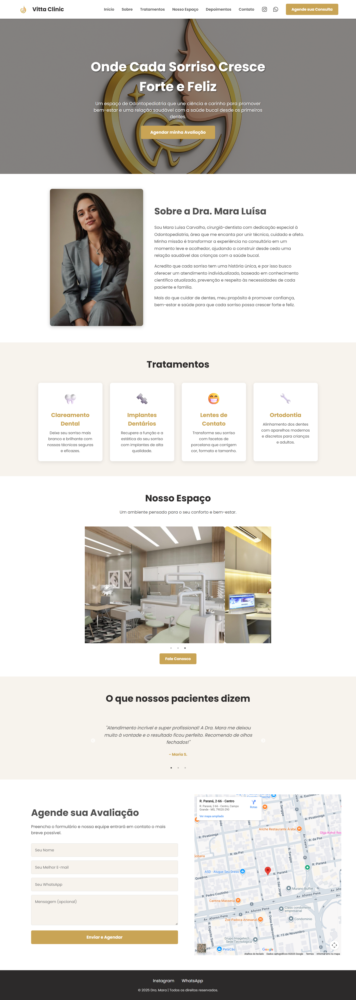

# Vitta Clinic - Landing Page Responsiva 


Uma landing page moderna e totalmente responsiva para uma clínica odontológica, com foco em odontopediatria. O projeto foi desenvolvido com React e Vite, seguindo as melhores práticas de componentização e experiência do usuário.

**➡️ [Acesse a demonstração ao vivo aqui!](https://LINK_DO_SEU_SITE_NO_AR_AQUI)**

---

## 📋 Índice

* [Sobre o Projeto](#-sobre-o-projeto)
* [📷 Preview](#-preview)
* [✨ Funcionalidades](#-funcionalidades)
* [🛠️ Tecnologias Utilizadas](#-tecnologias-utilizadas)
* [🚀 Como Rodar o Projeto](#-como-rodar-o-projeto)
* [📄 Licença](#-licença)

---

## 📖 Sobre o Projeto

Este projeto foi criado como uma solução completa de front-end para a **Vitta Clinic**, uma clínica odontológica especializada em atendimento infantil. O objetivo foi desenvolver uma interface limpa, elegante e acolhedora, que transmitisse profissionalismo e confiança para os pais, ao mesmo tempo em que apresenta as informações da clínica de forma clara e acessível em qualquer dispositivo.

---

## 📷 Preview



*(Aqui você vai colocar uma captura de tela do seu projeto finalizado)*

---

## ✨ Funcionalidades

- **Design Responsivo:** Layout adaptável para desktops, tablets e celulares.
- **Navegação Intuitiva:** Cabeçalho fixo e menu hambúrguer animado para uma experiência de uso fluida.
- **Componentes Interativos:** Carrosséis para exibição de fotos da clínica e depoimentos de pacientes.
- **Animações Modernas:** Efeitos de "fade" e "slide" ao rolar a página para uma navegação mais dinâmica.
- **Formulário de Contato Funcional:** Integração com o serviço Formspree para envio de e-mails.
- **Mapa Interativo:** Incorporação do Google Maps para fácil localização da clínica.

---

## 🛠️ Tecnologias Utilizadas

O projeto foi desenvolvido com as seguintes tecnologias e bibliotecas:

* **[React.js](https://react.dev/)**: Biblioteca principal para a construção da interface.
* **[Vite](https://vitejs.dev/)**: Ferramenta de build e servidor de desenvolvimento de alta performance.
* **JavaScript (ES6+)**
* **CSS3**: Para estilização, utilizando Flexbox, Grid e Media Queries.
* **[React Icons](https://react-icons.github.io/react-icons/)**: Para a utilização de ícones (Instagram, WhatsApp).
* **[React Slick](https://react-slick.neostack.com/)**: Para a criação dos carrosséis.
* **[AOS (Animate On Scroll)](https://michalsnik.github.io/aos/)**: Para as animações de rolagem.

---

## 🚀 Como Rodar o Projeto

Para rodar este projeto localmente, siga os passos abaixo:

1. **Clone o repositório**
   ```bash
   git clone [https://github.com/SEU_USUARIO/NOME_DO_SEU_REPOSITORIO.git](https://github.com/SEU_USUARIO/NOME_DO_SEU_REPOSITORIO.git)